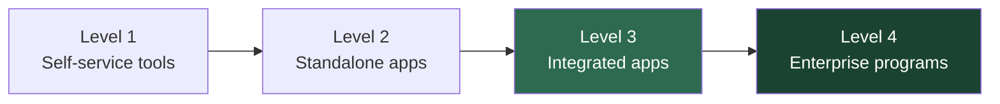

# InfraOps AI — CIO Project Evaluation Report

**Prepared for:** Chief Information Officer  
**Project:** InfraOps AI — Enterprise Agentic RAG Platform  
**Organization context:** Meridian Grid Services (demonstration / portfolio platform)  
**Report date:** July 2, 2026  
**Version:** 1.0  
**Classification:** Internal — Executive Review  

---

## 1. Executive Summary

InfraOps AI is a **production-ready demonstration platform** that models how an energy-infrastructure EPC organization can deploy governed, enterprise-grade AI assistants on top of operational and analytical data. All five planned build phases are **complete**. The system boots with a single command, delivers grounded answers with citations, enforces role-based access and human review, and includes measurable quality scoring—not a slide-deck prototype.

### Bottom line for the CIO

| Dimension | Assessment | Confidence |
|-----------|------------|------------|
| **Delivery against plan** | All Phase 1–5 objectives met | High |
| **Technical credibility** | Real RAG, real eval metrics, real Databricks medallion path | High |
| **Production readiness (enterprise)** | Demo/Pilot — not yet hardened for enterprise rollout | Medium |
| **Governance posture** | Strong MVP: RBAC, audit, HITL, security-level filtering | Medium–High |
| **Operational visibility** | Dashboards, admin tooling, automated feature test suite | Medium |
| **Strategic alignment** | Maps cleanly to AI maturity Levels 3–4 and Databricks medallion patterns | High |

**Recommendation:** Treat InfraOps AI as a **validated pilot architecture** suitable for executive demonstration, internal capability assessment, and as a blueprint for a business-unit pilot (e.g., Engineering Safety, Legal/Contracts, or Project Controls). Proceed to a **controlled production pilot** only after addressing identity (SSO), secrets management, and Databricks workspace provisioning at organizational scale.

---

## 2. Project Purpose & Business Context

### 2.1 Why this project exists

InfraOps AI was built to demonstrate readiness for an internal AI operating model aligned with modern enterprise practice:

- **AI maturity Levels 3–4** — integrated, governed applications backed by enterprise data—not isolated chat experiments.
- **Databricks medallion architecture** — Bronze → Silver → Gold with Unity Catalog, not diagram-only data strategy.
- **Forward-deployed engineering** — domain-specific agents (RAG, review, IoT) scoped to business units.
- **Human-in-the-loop by default** — high-risk outputs route through review before action.
- **Build vs. buy discipline** — documented decisions on LLM APIs, vector search, and custom orchestration.
- **Evaluation as first-class** — groundedness, citation accuracy, and hallucination tracking—not vanity metrics.

### 2.2 Domain framing

The platform serves **Meridian Grid Services**, a fictional energy-infrastructure EPC company. All documents, contracts, project reports, and IoT data are **synthetic**—there is no exposure of real QISG or client data. This is intentional: the platform proves architecture and process without data-governance risk during evaluation.

### 2.3 Target users (role model)

| Role | Primary use | Access scope |
|------|-------------|--------------|
| **Engineer** | AI Assistant + document upload | Assistant only (RBAC-enforced) |
| **Project Manager** | Projects, documents, reviews, IoT | Operational views |
| **Safety Officer** | Human review of flagged AI outputs | Review queue + documents |
| **Executive** | KPI dashboard, portfolio metrics | Read-heavy executive views |
| **Admin** | Settings, audit, feature tests, queues | Full configuration |

---

## 3. Delivery Status

### 3.1 Phase completion (original build plan)

| Phase | Scope | Status | Definition of Done |
|-------|-------|--------|-------------------|
| **1 — Foundation** | React UI, NestJS API, Postgres, Redis, JWT auth, Docker, CI | ✅ Complete | `docker compose up` boots; login works |
| **2 — Document RAG** | Upload, chunk, embed, pgvector retrieval, cited answers | ✅ Complete | Grounded Q&A from seed documents |
| **3 — Review + Eval + IoT** | HITL workflow, eval harness, IoT simulator + alerts | ✅ Complete | Review lifecycle; `npm run eval` scorecard; IoT alerts |
| **4 — Databricks** | Medallion notebooks, Vector Search adapter, MLflow | ✅ Complete | Gold-layer retrieval via feature flag |
| **5 — Polish** | Architecture docs, README, executive dashboard | ✅ Complete | 15-minute stranger onboarding |

**Overall delivery: 100% of scoped phases complete.**

### 3.2 Post–Phase 5 enhancements (not in original phase plan)

These capabilities were added after the core build and strengthen operational readiness:

| Enhancement | Business value |
|-------------|----------------|
| **Tri-hybrid retrieval** (semantic + keyword + intent) | Better answer quality across safety, contract, and engineering queries |
| **Database-managed Admin settings** | Runtime config without redeploy; API keys and retrieval backend toggled in UI |
| **Enhanced audit log** | Who/what/how changed with before/after diffs for compliance review |
| **Engineer role RBAC** | Least-privilege access for field engineers using AI Assistant only |
| **Automated Feature Test Suite** (~28 tests) | One-click regression in Admin; extensible registry for future features |
| **Databricks → pgvector fallback** | Local demo resilience when Databricks is misconfigured or unavailable |
| **Projects page** | Real project data instead of placeholder UI |

---

## 4. Capability Assessment

### 4.1 Delivered capabilities (working today)

#### AI Assistant (RAG Agent)
- Natural-language Q&A over 15 indexed domain documents (engineering, safety SOPs, contracts, project reports).
- **Tri-hybrid retrieval:** 50% semantic (embeddings), 30% keyword (full-text), 20% intent alignment.
- Rule-based intent classifier routes queries to relevant document types (e.g., safety questions boost `safety_sop`).
- Structured citations with document title, revision, and excerpt.
- Automatic async quality scoring after every query.
- Configurable review triggers for low-confidence, safety, contract, and executive topics.

#### Document management
- Seed ingest of 15 synthetic documents with rich metadata (type, discipline, security level, revision).
- Upload pipeline: parse → chunk → embed → index (async via BullMQ worker).
- Processing status visible in UI.

#### Human-in-the-loop review
- Configurable trigger rules (low confidence, safety keywords, contract terms, executive reports).
- Safety/PM/Executive/Admin reviewers can approve or reject flagged outputs.
- Decisions logged to audit trail; reviewer sentiment feeds evaluation feedback loop.

#### Executive dashboard
- Live KPIs: document counts, agent runs, evaluation metrics, pending reviews, IoT alerts, queue health.
- Retrieval backend status (pgvector vs Databricks).
- Recharts visualizations for evaluation scores and document distribution.

#### IoT monitoring (prototype)
- Seeded devices for substation monitoring simulation.
- Anomaly detection on streamed sensor readings.
- Live alert panel; simulator script for demo scenarios.

#### Admin & operations
- **Settings panel** — LLM keys, retrieval backend, Databricks config, MLflow URI (secrets masked in UI).
- **Audit log** — expandable change diffs for settings updates and review decisions.
- **Queue metrics** — BullMQ job counts for document, IoT, evaluation, and feature-test processors.
- **Feature Test Suite** — ~28 automated tests across platform, auth, data, RAG, workflow, and settings; run history persisted.

#### Databricks integration (optional path)
- Four notebooks: Bronze ingest → Silver transform → Gold curate → Vector Search index.
- Unity Catalog setup SQL for `infraops.bronze / silver / gold`.
- Retrieval adapter reads **Gold layer only** when `RETRIEVAL_BACKEND=databricks`.
- SQL fallback when Vector Search quota unavailable (Free Edition constraint).
- MLflow experiment logging for eval harness runs.

### 4.2 Capabilities not yet delivered (roadmap)

| Capability | SDLC stage | Notes |
|------------|------------|-------|
| Contract Agent (standalone) | Discover | Tool signatures defined; no dedicated agent surface |
| Project Agent (standalone) | Discover | Gold KPIs exist in notebooks; no agent UI |
| Azure Entra ID SSO | Discover | JWT-only today; documented stretch goal |
| MCP server for external clients | Discover | Section 22 stretch goal |
| Multi-agent collaboration | Discover | Not implemented |
| Unity Catalog RBAC demo | Discover | Requires Databricks Premium |
| OpenTelemetry distributed tracing | Prototype | Structured logs exist; full trace propagation not wired |
| Formal compliance (SOC 2, ISO 27001) | Out of scope | Documented in governance roadmap |

---

## 5. AI Maturity Alignment

The platform intentionally mirrors an **AI maturity Level 3–4** operating model:



**InfraOps AI today sits at Level 3 (Pilot) with Level 4 patterns demonstrated:**

| Level 4 pattern | Evidence in InfraOps AI |
|-----------------|-------------------------|
| Governed enterprise data | Metadata schema, security levels, medallion architecture |
| Human oversight | Review workflow with audit trail |
| Measurable quality | 7 evaluation metrics + 15-question scorecard |
| Role-based access | 5 roles with clearance-aware retrieval |
| Platform thinking | Shared packages, adapter pattern, feature flags |
| Continuous improvement | Eval harness, feature tests, MLflow optional tracking |

---

## 6. Architecture & Technology Decisions

### 6.1 High-level architecture

```
┌─────────────────────────────────────────────────────────────┐
│  React Dashboard (7 pages)  ──JWT──▶  NestJS API Gateway    │
│                                         │                    │
│                    ┌────────────────────┼────────────────┐   │
│                    ▼                    ▼                ▼   │
│              Agent Orchestrator   Intent Classifier   RBAC   │
│                    │                    │                    │
│                    └──────── Tri-Hybrid Retriever ────────┘   │
│                              │         │                      │
│                         pgvector   Databricks Gold            │
│                              │         │                      │
│                    PostgreSQL 16    Bronze→Silver→Gold       │
│                    + Redis 7 + BullMQ Worker                  │
└─────────────────────────────────────────────────────────────┘
```

### 6.2 Build vs. buy decisions (CIO-relevant)

| Capability | Decision | Rationale | Swap cost |
|------------|----------|-----------|-----------|
| LLM generation | **Buy** (Claude / OpenAI API) | Quality, time-to-market | Low — adapter pattern |
| Embeddings | **Buy** (OpenAI text-embedding-3-small) | Standard 1536-dim vectors | Low — hash fallback for dev |
| Vector search (cloud) | **Buy** (Databricks Vector Search) | Aligns with org data platform | Medium — feature flag |
| Vector search (local) | **Build** (pgvector) | Zero cloud dependency for dev/CI | N/A |
| Agent orchestration | **Build** | Domain review rules, citations, intent | High — core IP |
| Evaluation harness | **Build** | Portfolio + interview artifact | Medium |
| Human review workflow | **Build** | Configurable business rules | Medium |
| Identity | **Build** (JWT MVP) | Fast demo; Entra ID is stretch | Medium when upgrading |

**CIO takeaway:** The platform follows sensible buy-for-commodity / build-for-differentiation economics. LLM and vector infrastructure can be swapped without rewriting business logic.

### 6.3 Technology stack (pinned, auditable)

| Layer | Technology | Version |
|-------|------------|---------|
| Frontend | React + Vite + Tailwind + Recharts | 18 / 6 |
| Backend | NestJS + Prisma | 11 / 6 |
| Database | PostgreSQL + pgvector | 16 |
| Queue | BullMQ + Redis | 5 / 7 |
| Data platform | Databricks (Delta + Unity Catalog) | Free Edition compatible |
| CI/CD | GitHub Actions | Node 20 |

---

## 7. Governance, Security & Compliance

### 7.1 Implemented controls

| Control | Implementation | Maturity |
|---------|----------------|----------|
| **Authentication** | JWT with server-side validation | MVP |
| **Authorization (RBAC)** | 5 roles; route and retrieval clearance enforced | Pilot |
| **Document security levels** | `public` → `restricted`; filtered at retrieval | Pilot |
| **Audit logging** | Structured metadata, before/after diffs for settings | Pilot |
| **Human review** | Configurable triggers; approve/reject with comments | Pilot |
| **Secrets handling** | API keys in DB settings; masked in admin UI; no client-side keys | MVP |
| **Synthetic data only** | No real customer/employee data in demo | Complete |

### 7.2 Review trigger rules (high-risk output gating)

| Rule | Trigger condition |
|------|-------------------|
| Low confidence | Retrieval confidence below 0.35 |
| Safety recommendation | Safety keywords in question or answer |
| Contract summary | Contract citations or liability terms detected |
| Executive report | Portfolio/budget/executive keywords |

### 7.3 Known gaps (honest assessment)

- **No enterprise SSO** — demo uses email/password; Entra ID is documented but not built.
- **No formal compliance certification** — SOC 2 / ISO 27001 not in scope.
- **No per-field encryption** — standard Postgres at rest depends on infrastructure.
- **No Databricks Unity Catalog RBAC demo** — requires Premium tier.
- **Demo credentials are hardcoded** — acceptable for portfolio; unacceptable for production.

**Risk rating for demo use:** Low.  
**Risk rating for production without remediation:** High.

---

## 8. Quality Assurance & Evaluation

### 8.1 Continuous evaluation (every agent run)

Each RAG query triggers async scoring:

| Metric | What it measures |
|--------|------------------|
| **Groundedness** | Answer content overlap with retrieved chunks |
| **Citation accuracy** | Valid cited chunk IDs / total citations |
| **Relevance** | Question–answer token overlap |
| **Hallucination flag** | Groundedness below threshold with citations present |
| **Retrieval hit rate** | At least one chunk retrieved |
| **Latency** | End-to-end response time (ms) |
| **User rating** | Reviewer approve (+1) / reject (−1) |

### 8.2 RAG evaluation harness (`npm run eval`)

- **15 fixed test questions** covering safety, contracts, engineering, and project reporting.
- Pass criteria: groundedness ≥ 0.30 AND citation accuracy ≥ 0.50.
- Suite pass threshold: ≥ 60% of questions pass.
- Optional MLflow logging to experiment `infraops-rag-eval`.

**Reference scorecard (pgvector, seeded environment):**

| Metric | Typical result |
|--------|----------------|
| Pass rate | 12/15 (80%) |
| Avg groundedness | 0.36 |
| Avg citation accuracy | 1.00 |
| Hallucination rate | ~15% |
| Retrieval hit rate | 100% |
| Avg latency | ~450 ms |

> Exact numbers vary with LLM/embedding configuration. Re-run locally for current evidence.

### 8.3 Automated Feature Test Suite (Admin dashboard)

| Category | Tests | What is verified |
|----------|-------|------------------|
| Platform | 2 | Database and Redis connectivity |
| Auth | 1 | Admin demo login |
| Data | 4 | Documents, chunks, projects, IoT devices seeded |
| RAG | 18 | Intent classification, retrieval, 15 eval questions |
| Workflow | 2 | Review queue and audit log accessible |
| Settings | 1 | Runtime configuration loaded |
| **Total** | **~28** | Full-stack regression |

Tests run asynchronously via BullMQ; results and run history visible in **Admin → Feature Test Suite**. New features can be added to the registry without UI changes.

### 8.4 CI pipeline (GitHub Actions)

On every push/PR to `main`:

1. Lint  
2. Typecheck  
3. Database migrate (Postgres + pgvector service)  
4. Unit tests  
5. Full monorepo build  

**CI status:** Pipeline configured and operational per project documentation.

---

## 9. Operational Readiness

### 9.1 Deployment

| Topology | Command | Use case |
|----------|---------|----------|
| **Local demo** | `docker compose up --build` | Executive walkthrough, developer onboarding |
| **Databricks-connected** | Notebooks 01→04 + Admin settings | Gold-layer retrieval demonstration |
| **Dev (partial Docker)** | Postgres + Redis in Docker; apps native | Active development |

**Time to running demo:** ~15 minutes (documented in README).

### 9.2 Observability

| Signal | Mechanism |
|--------|-----------|
| Request logs | Structured JSON (Pino) with `trace_id` |
| Health check | `GET /api/health` — DB, Redis, retrieval backend |
| Admin metrics | Queue counts, eval summary, audit log |
| Executive KPIs | `GET /api/dashboard/executive` |
| Experiment tracking | MLflow (optional) |

### 9.3 Configuration management

- Bootstrap secrets (DB, Redis, JWT) remain in `.env` for container startup.
- Application config (LLM keys, retrieval backend, Databricks) managed via **Admin → Settings** in database—no redeploy required for config changes.

---

## 10. Risks & Limitations

| Risk | Severity | Mitigation status |
|------|----------|-------------------|
| Demo credentials in seed data | Medium (demo) / Critical (prod) | Documented; must replace before production |
| LLM API cost & availability | Medium | Adapter fallback chain (Claude → OpenAI → stub) |
| Databricks Free Edition limits | Medium | pgvector fallback; SQL fallback for Vector Search |
| Evaluation metrics are heuristic, not LLM-as-judge | Low–Medium | Documented; upgrade path exists in original spec |
| No enterprise identity integration | High (for prod) | Entra ID on roadmap |
| Single-tenant demo architecture | Medium | Expected; multi-tenancy not scoped |
| Synthetic data ≠ production document complexity | Low | Expected for portfolio; pilot needs real docs |

---

## 11. Recommendations

### 11.1 Immediate actions (0–30 days)

1. **Schedule a live executive demo** — 30-minute walkthrough: Executive Dashboard → AI Assistant (safety question) → Human Review → Admin feature tests → IoT alert.
2. **Capture evidence pack** — Run `npm run eval` and Admin Feature Test Suite; archive outputs for audit trail.
3. **Decision on Databricks workspace** — Provision org workspace if Gold-layer retrieval demo is required for stakeholders.

### 11.2 Short-term pilot (30–90 days)

1. **Select one business unit** — e.g., Electrical Safety (LOTO/SOP queries) or Contracts (liability clause lookup).
2. **Ingest 20–50 real documents** (redacted/synthetic mix) with proper metadata and security levels.
3. **Integrate Azure Entra ID** — replace JWT demo auth for pilot users.
4. **Assign human reviewers** — safety or legal SMEs with defined SLAs.
5. **Establish eval baseline** — weekly `npm run eval` + feature test runs; track pass rate trend in MLflow or internal dashboard.

### 11.3 Medium-term production path (90–180 days)

1. **Secrets management** — Azure Key Vault or equivalent; remove DB-stored API keys for production.
2. **OpenTelemetry** — end-to-end tracing from API → agent → retrieval → LLM.
3. **Expand agent portfolio** — Contract Agent and Project Agent from Discover → Pilot.
4. **Unity Catalog RBAC** — Databricks Premium for column/table-level governance demo.
5. **MCP server** — expose agent tools to approved external clients (Copilot, custom apps).

### 11.4 What not to do yet

- Do not expose demo credentials to external users.
- Do not ingest production data without classification and legal review.
- Do not skip human review for safety or contract outputs in any pilot.
- Do not treat 80% eval pass rate as production SLA without baseline on real data.

---

## 12. CIO Decision Framework

Use this checklist to decide next investment:

| Question | Current answer |
|----------|----------------|
| Does the team deliver working software, not slides? | **Yes** — runnable in 15 minutes |
| Is AI output governable? | **Yes** — RBAC, security levels, HITL, audit |
| Can we measure quality? | **Yes** — 7 metrics, scorecard, feature tests |
| Does it align with our data platform strategy? | **Yes** — Databricks medallion, Gold-only retrieval |
| Is it production-ready for enterprise rollout? | **Not yet** — identity, secrets, compliance gaps |
| Is it a credible pilot foundation? | **Yes** — architecture and patterns are sound |
| Can we explain build vs. buy to the board? | **Yes** — documented in architecture |

**Suggested CIO disposition:** **Approve as internal reference architecture and authorize a bounded business-unit pilot** with explicit success criteria (eval pass rate on real docs, reviewer approval rate, user adoption in target role).

---

## 13. Appendix

### A. Demo access

| Service | URL |
|---------|-----|
| Web dashboard | http://localhost:5173 |
| API + Swagger | http://localhost:3000/api/docs |
| Health check | http://localhost:3000/api/health |

| Role | Email | Password |
|------|-------|----------|
| Admin | `admin@meridiangrid.com` | `password123` |
| Engineer | `engineer@meridiangrid.com` | `password123` |
| Safety (reviewer) | `safety@meridiangrid.com` | `password123` |

### B. Key documentation index

| Document | Purpose |
|----------|---------|
| [README.md](../README.md) | 15-minute setup and demo walkthrough |
| [docs/architecture.md](./architecture.md) | As-built architecture and diagrams |
| [docs/rag.md](./rag.md) | RAG pipeline and tri-hybrid retrieval |
| [docs/evaluation.md](./evaluation.md) | Metrics and scorecard |
| [docs/governance.md](./governance.md) | RBAC, review rules, audit |
| [docs/ai-sdlc.md](./ai-sdlc.md) | Component maturity by SDLC stage |
| [docs/SUCCESS_CHECKLIST.md](./SUCCESS_CHECKLIST.md) | Phase 5 success criteria |
| [CHANGELOG.md](../CHANGELOG.md) | Version history (v0.1.0 → v0.5.0) |

### C. Version history summary

| Version | Phase | Highlights |
|---------|-------|------------|
| v0.1.0 | 1 | Foundation, Docker, JWT, CI |
| v0.2.0 | 2 | Document RAG, pgvector, citations |
| v0.3.0 | 3 | HITL review, eval harness, IoT |
| v0.4.0 | 4 | Databricks medallion + retrieval adapter |
| v0.5.0 | 5 | Executive dashboard, architecture docs, README |

### D. Suggested demo script (30 minutes)

1. **(5 min)** Executive Dashboard — document count, eval metrics, retrieval backend, IoT alerts.
2. **(5 min)** AI Assistant — ask *"What is the lockout-tagout procedure?"* — show intent badge and citations.
3. **(5 min)** Human Review — login as Safety; approve/reject a flagged response; show audit entry.
4. **(5 min)** Admin — run Feature Test Suite; show pass/fail breakdown by category.
5. **(5 min)** Settings — show database-managed config; toggle retrieval backend concept.
6. **(5 min)** Architecture walkthrough — medallion diagram, build vs. buy, roadmap.

### E. Glossary

| Term | Definition |
|------|------------|
| **RAG** | Retrieval-Augmented Generation — LLM answers grounded in retrieved documents |
| **HITL** | Human-in-the-Loop — manual review before acting on AI output |
| **Medallion architecture** | Databricks pattern: Bronze (raw) → Silver (cleaned) → Gold (business-ready) |
| **pgvector** | PostgreSQL extension for vector similarity search |
| **Tri-hybrid retrieval** | Combined semantic, keyword, and intent-based search scoring |

---

*This report reflects the as-built state of InfraOps AI as of July 2, 2026. For technical deep-dives, refer to the documentation index in Appendix B. For questions or a live demonstration, contact the project owner.*

**Report prepared by:** InfraOps AI Engineering  
**Review cycle:** Update after each major release or pilot milestone
