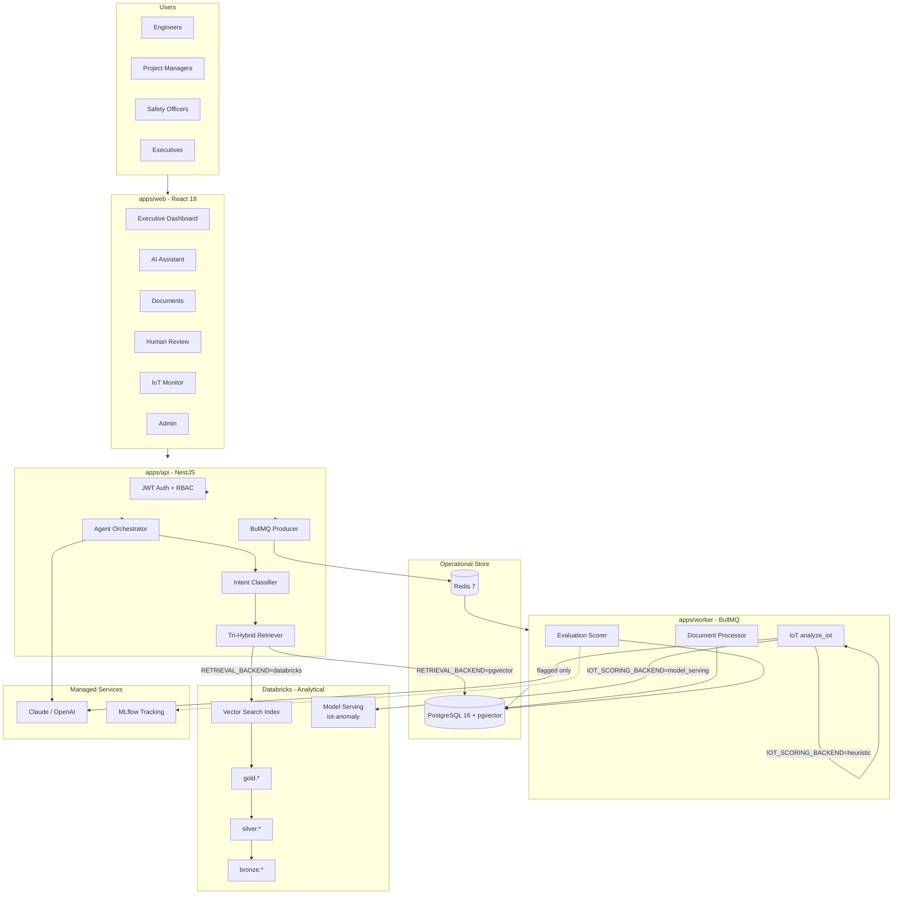
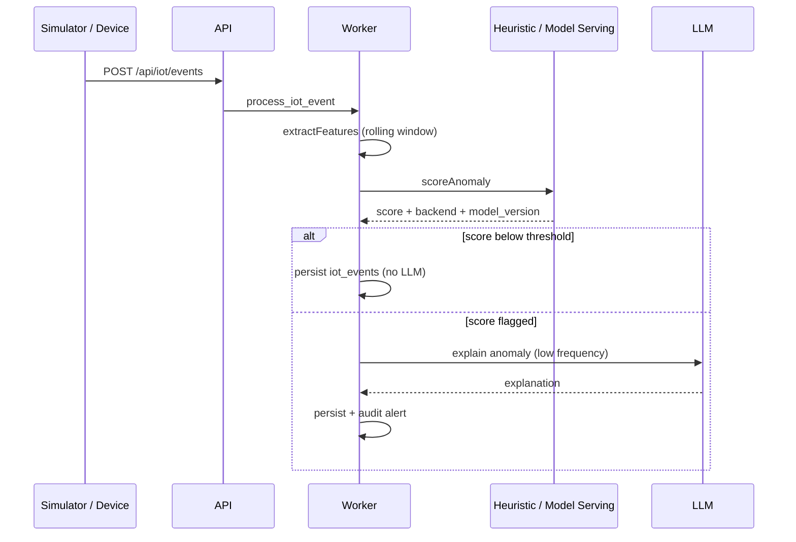
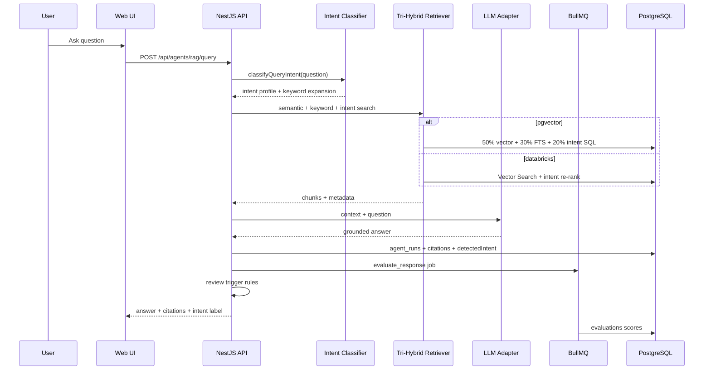
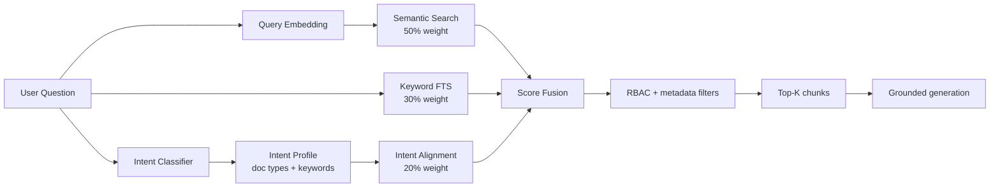

# Architecture - InfraOps AI

> As-built documentation reflecting the implemented system (Phases 1–5).

## System context

InfraOps AI is an enterprise agentic RAG platform for **Meridian Grid Services**, a fictional energy-infrastructure EPC company. It demonstrates AI maturity Level 3/4 patterns: governed data, human-in-the-loop review, evaluation harness, and Databricks medallion architecture.



## IoT anomaly scoring (two-step)



See [iot-anomaly-model.md](./iot-anomaly-model.md).

## Request flow - RAG query



## Tri-hybrid retrieval architecture



| Signal | Purpose | Example |
|--------|---------|---------|
| Semantic | Meaning similarity via embeddings | "LOTO steps" matches "lockout-tagout procedure" |
| Keyword | Exact term matching via FTS | "Helix Power" matches contract clause |
| Intent | Domain routing to doc types | Safety question boosts `safety_sop` documents |

## Monorepo layout

| Path | Role |
|------|------|
| `apps/web` | React dashboard - 7 pages, dark enterprise UI |
| `apps/api` | NestJS gateway, JWT, OpenAPI, agent orchestration |
| `apps/worker` | BullMQ processors + eval harness |
| `packages/shared` | Zod schemas, env validation, review rules |
| `packages/ai-tools` | LLM adapters, retrieval, chunking, scoring |
| `databricks/` | Bronze/Silver/Gold notebooks, Unity Catalog SQL |
| `seed/` | 15 synthetic documents + IoT simulator |

## Technology stack (pinned)

| Layer | Technology | Version |
|-------|------------|---------|
| Frontend | React + Vite + Tailwind + Recharts | 18 / 6 |
| Backend | NestJS + Prisma | 11 / 6 |
| Database | PostgreSQL + pgvector | 16 |
| Queue | BullMQ + Redis | 5 / 7 |
| LLM | Anthropic Claude → OpenAI → stub | API |
| Embeddings | OpenAI text-embedding-3-small | 1536-dim |
| Data platform | Databricks Free Edition | Delta + UC |
| Eval tracking | MLflow REST API | optional |
| CI | GitHub Actions | Node 20 |

## Data architecture

### Operational (PostgreSQL)

Single source of truth for **application state**: users, documents, chunks (pgvector cache), agent_runs, reviews, evaluations, IoT events, audit_log.

Retrieval rule: pgvector reads local `document_chunks` when `RETRIEVAL_BACKEND=pgvector`.

### Analytical (Databricks medallion)

| Layer | Tables | Purpose |
|-------|--------|---------|
| Bronze | `documents_raw`, `iot_events_raw` | Immutable ingest |
| Silver | `documents_parsed`, `document_chunks`, `iot_events` | Parsed, chunked, validated |
| Gold | `document_chunks`, `project_kpis`, `risk_scores`, `iot_daily_rollup` | Business-ready |
| Index | `document_chunks_index` | Vector Search (optional) |

Retrieval rule: **Gold layer only** when `RETRIEVAL_BACKEND=databricks` - never Bronze/Silver directly.

## Build vs. buy decisions

| Capability | Decision | Rationale |
|------------|----------|-----------|
| LLM generation | **Buy** - Claude/OpenAI API | Quality, speed-to-market; adapter allows swap |
| Vector search (prod demo) | **Buy** - Databricks Vector Search | Aligns with org data platform; governed Gold data |
| Vector search (local dev) | **Build** - pgvector | Zero cloud dependency for CI and offline demo |
| Agent orchestration | **Build** | Domain-specific review rules, citations, RBAC, intent classifier |
| Evaluation harness | **Build** | Portfolio artifact; 15-question scorecard |
| Human review workflow | **Build** | Configurable trigger rules table |
| IoT anomaly scoring | **Build** features + **Buy** Model Serving | Small classifier for high-frequency events; LLM only explains flags |
| Identity (MVP) | **Build** - JWT | Entra ID documented as stretch goal |

## Security & governance (implemented)

- RBAC: `engineer`, `pm`, `safety`, `executive`, `admin`
- Document `security_level` enforced at retrieval via `ROLE_CLEARANCE` map
- Review decisions → `audit_log` + `evaluations.user_rating`
- All LLM calls server-side; no client API keys
- See [governance.md](./governance.md)

## Observability

- Structured JSON logs via Pino (`trace_id` on agent runs)
- Health endpoint: DB, Redis, retrieval backend status
- Admin: queue metrics, audit log, evaluation summary
- MLflow experiment `infraops-rag-eval` for harness runs

## Deployment topologies

### Local (15-minute demo)

```bash
docker compose up --build
```

Boots: postgres, redis, api (migrate + seed), worker, web.

### Databricks-connected

1. Run notebooks `01` → `04` ([databricks/README.md](../databricks/README.md))
2. Set `RETRIEVAL_BACKEND=databricks` in `.env`
3. Restart API - health shows `retrievalBackend: databricks`

## API surface (implemented)

| Method | Path | Auth |
|--------|------|------|
| POST | `/api/auth/login` | Public |
| GET | `/api/health` | Public |
| GET | `/api/dashboard/executive` | JWT |
| POST | `/api/agents/rag/query` | JWT |
| POST | `/api/documents/upload` | JWT |
| GET | `/api/reviews/pending` | JWT |
| POST | `/api/reviews/:runId/decide` | JWT + role |
| GET | `/api/evaluations/summary` | JWT |
| GET | `/api/admin/audit-log` | JWT + admin/exec |
| POST | `/api/iot/events` | JWT |

Full OpenAPI: http://localhost:3000/api/docs

## Related docs

- [RAG pipeline](./rag.md)
- [IoT anomaly model](./iot-anomaly-model.md)
- [Evaluation framework](./evaluation.md)
- [Governance](./governance.md)
- [AI SDLC status](./ai-sdlc.md)
